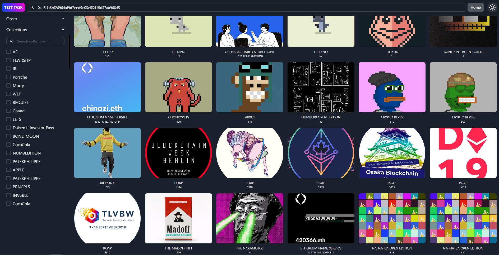
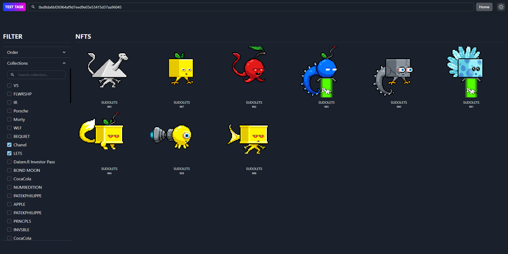

# NFT MARKETPLACE

## Getting started

```
git clone https://github.com/malcodeman/nft-marketplace.git nft-marketplace
cd nft-marketplace/webapp
yarn install && yarn dev
```

## Screenshots

1. User can search the NFT tokens of the wallet like this




2. User can filter by selecting collections

